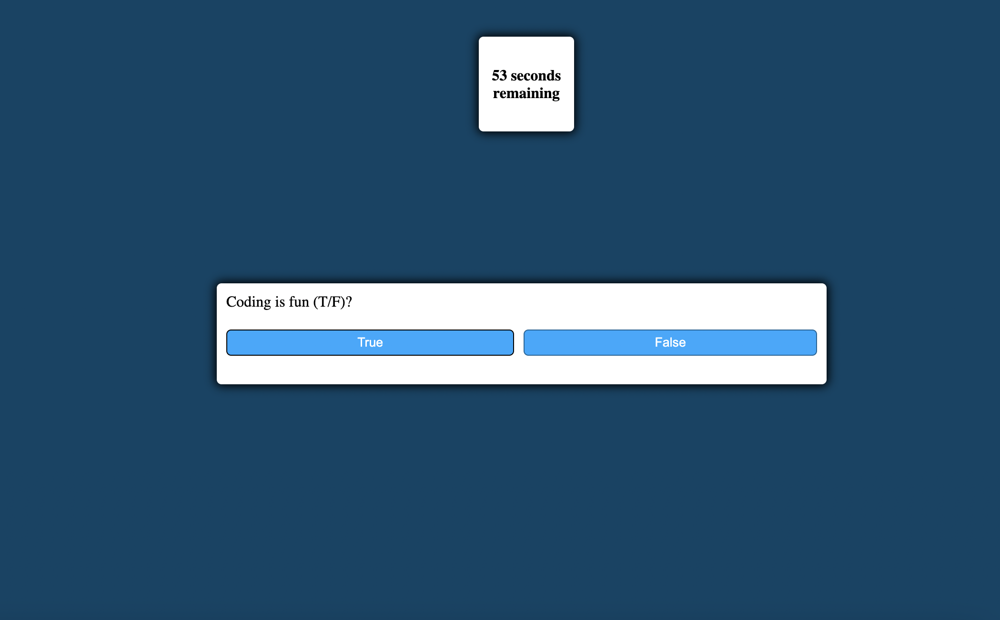

# JavaScript-Timed-Quiz

In Homework-4, I have completed all of the acceptance criteria, including:
- There is a time decrement of 10 seconds everytime you get a question wrong
- The quiz ends when the timer reaches zero
- The timer starts when the quiz starts
- You are able to see and save your scores and initials using local storage

## Link and Screenshot

You can access the live website [here](https://dltorrise.github.io/JavaScript-Timed-Quiz/)

Here is a screenshot:

## Acknowledgments

That you to Web Dev Simplified for helping me learn how to create a JavaScript Quiz. I used this video to help me create the foundational structure for the quiz. 

[Video](https://www.youtube.com/watch?v=riDzcEQbX6k)

[His Channel](https://www.youtube.com/@WebDevSimplified)
